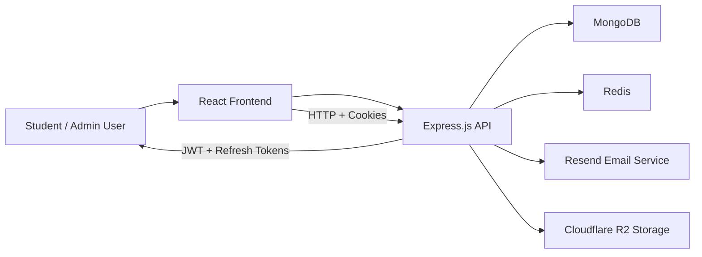
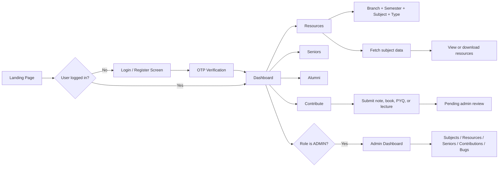

# NIT KKR Academic Portal

A university-specific academic portal built for students of NIT Kurukshetra. The system helps students access study resources, connect with seniors and alumni, report issues, and contribute academic materials in a secure, role-based environment.

This repository contains both the frontend application and the backend API, working together to provide a complete student resource ecosystem.

## Overview

The portal is designed around a simple but powerful idea:

- Students should be able to find notes, books, PYQs, and lecture resources quickly.
- Access should be organized by branch and semester.
- Access should be limited to valid NIT Kurukshetra email users.
- Students should be able to help each other by contributing resources.
- Admins should be able to review, moderate, and maintain all platform content.

## Project goals

- Build a secure academic portal for NIT KKR students.
- Restrict registration and access to @nitkkr.ac.in emails only.
- Organize academic resources by branch, semester, and subject.
- Allow students to contribute and upload learning materials.
- Provide quick access to seniors and alumni for mentorship.
- Make admin moderation available for resources, contributions, and bug reports.
- Use cloud storage for scalable file delivery without bloating the database.

---

## High-level architecture



### What each layer does

- Frontend: handles pages, auth flows, dashboards, resource browsing, and admin panels.
- Backend: exposes API routes, validates inputs, enforces access rules, and coordinates MongoDB, Redis, and storage actions.
- MongoDB: stores user accounts, subjects, resources, mentors, contributions, and bugs.
- Redis: stores refresh-token sessions and rate limiting state.
- Email service: sends OTPs for account verification and password reset.
- Cloudflare R2: stores uploaded files securely and serves signed download URLs.

---

## Core features

### 1. Domain-restricted authentication

User accounts are restricted to valid NIT Kurukshetra emails.

- Email format must match @nitkkr.ac.in
- Registration requires a password and OTP verification
- Login uses JWT access tokens and refresh tokens
- Tokens are issued and stored in HTTP-only cookies
- Password reset and verification also use OTP-based flows

### 2. Branch and semester-based academic discovery

Resources are organized by:

- Branch
- Semester
- Subject
- Resource type

Supported resource categories:

- NOTES
- BOOKS
- PYQS
- LECTURES

### 3. Student contribution workflow

Students can submit academic materials for moderation.

- Resource upload or link submission
- Subject selection is tied to branch + semester
- Contributions remain pending until approved by an admin
- Admins can approve, update, download, or delete contributions

### 4. Senior and alumni network

Students can browse senior profiles by branch and year.

Supported mentor/current-year categories:

- 2nd Year
- 3rd Year
- 4th Year
- Alumni

Mentor data includes:

- Name
- Branch
- Current year
- Batch
- Email
- LinkedIn
- Tags
- Experience
- Achievements

### 5. Admin dashboard

Admins can manage all major entities in one place:

- Manage subjects
- Manage resources
- Manage seniors
- Review contributions
- Review and close bugs
- View stats and platform activity

### 6. Bug reporting and moderation

Students can report platform issues with optional file attachments (screenshots/PDFs up to 5MB). Admins can:

- view bug reports and securely download attached files
- resolve bugs (automatically cleans up attachments from R2)
- delete invalid reports (automatically cleans up attachments from R2)

### 7. Security and rate limiting

The backend includes protections such as:

- JWT verification middleware
- role-based access control
- Redis-backed rate limiting
- OTP expiry checks
- session refresh validation
- cookie security options

---

## User roles

### USER

Regular student account.

Permissions:

- Register and verify email
- Log in and refresh session
- Browse resources
- View seniors/alumni
- Submit contributions
- Report bugs
- Change password

### ADMIN

Administrative role.

Permissions:

- Full subject management
- Full resource management
- Senior profile management
- Contribution moderation
- Bug moderation
- Access to admin dashboard

---

## Supported branches

The platform currently supports these branches:

- CSE
- IT
- AIDS
- AIML
- MNC
- ECE
- EE
- ME
- PIE
- CE

Semester support:

- 1 to 8

---

## Data model summary

### User

The User model stores:

- email
- password
- role
- isVerified
- emailVerificationOTP
- emailVerificationOTPExpires
- forgotPasswordOTP
- forgotPasswordOTPExpires

Key validations:

- email must match @nitkkr.ac.in
- unique email accounts only

### Subject

The Subject model stores:

- subjectCode
- subjectName
- offeredTo[]

Each subject is tied to specific branch + semester combinations. This allows precise matching when students browse resources.

### Resource

Resource records include:

- subjectId
- title
- type
- fileName
- fileKey
- url
- uploadedBy

Files are uploaded to Cloudflare R2 and metadata is stored in MongoDB.

### Contribution

Contributions are like student-submitted resource drafts.

Fields:

- subjectId
- title
- type
- fileName
- fileKey
- url
- contributedBy
- status

A contribution is pending until the admin approves it.

### Mentor

Mentor data includes:

- name
- email
- branch
- currentYear
- batch
- image
- linkedin
- tags
- experiences
- achievements

### Bug

Bug entities include:

- description
- reportedBy
- status
- fileKey (optional)
- fileName (optional)
- mimeType (optional)
- fileSize (optional)

---

## Full application flow



---

## Backend structure

```text
backend/
├── src/
│   ├── config/
│   │   ├── db.js
│   │   ├── r2Client.js
│   │   ├── redis.js
│   │   └── resend.js
│   ├── constants/
│   │   ├── branches.js
│   │   ├── bugStatus.js
│   │   ├── contributionStatus.js
│   │   ├── mentorTags.js
│   │   ├── rateLimiterConstants.js
│   │   ├── resourceTypes.js
│   │   ├── roles.js
│   │   ├── semesters.js
│   │   └── statusCodes.js
│   ├── controllers/
│   │   ├── authController.js
│   │   ├── bugController.js
│   │   ├── contributionController.js
│   │   ├── mentorController.js
│   │   ├── resourceController.js
│   │   └── subjectController.js
│   ├── middlewares/
│   │   ├── adminMiddleware.js
│   │   ├── authMiddleware.js
│   │   ├── errorMiddleware.js
│   │   ├── rateLimiterMiddleware.js
│   │   └── uploadResourceFileMiddleware.js
│   ├── models/
│   │   ├── Bug.js
│   │   ├── Contribution.js
│   │   ├── Mentor.js
│   │   ├── Resource.js
│   │   ├── Subject.js
│   │   └── User.js
│   ├── repositories/
│   │   ├── authRepository.js
│   │   ├── bugRepository.js
│   │   ├── contributionRepository.js
│   │   ├── mentorRepository.js
│   │   ├── resourceRepository.js
│   │   └── subjectRepository.js
│   ├── routes/
│   │   ├── authRoutes.js
│   │   ├── bugRoutes.js
│   │   ├── contributionRoutes.js
│   │   ├── mentorRoutes.js
│   │   ├── resourceRoutes.js
│   │   └── subjectRoutes.js
│   ├── services/
│   │   ├── auth/
│   │   ├── authService.js
│   │   ├── bugService.js
│   │   ├── contributionService.js
│   │   ├── fileService.js
│   │   ├── mentorService.js
│   │   ├── resourceService.js
│   │   └── subjectService.js
│   ├── templates/
│   │   └── emails/
│   ├── utils/
│   │   ├── auth/
│   │   ├── cronJobs.js
│   │   ├── ApiError.js
│   │   ├── ApiResponse.js
│   │   ├── asyncHandler.js
│   │   └── mentorQueryBuilder.js
│   ├── validators/
│   │   ├── authValidator.js
│   │   ├── bugValidator.js
│   │   ├── contributionValidator.js
│   │   ├── mentorValidator.js
│   │   ├── resourceValidator.js
│   │   └── subjectValidator.js
│   ├── server.js
│   └── ...
├── package.json
├── .env
└── node_modules
```

---

## Frontend structure

```text
frontend/
├── src/
│   ├── components/
│   │   ├── ContributionManagement/
│   │   ├── ResourceManagement/
│   │   ├── SeniorManagement/
│   │   ├── SubjectManagement/
│   │   ├── ui/
│   │   └── Layout.jsx
│   ├── context/
│   │   └── AuthContext.jsx
│   ├── hooks/
│   │   └── useRateLimitCountdown.js
│   ├── pages/
│   │   ├── AdminDashboard.jsx
│   │   ├── Alumni.jsx
│   │   ├── Auth.jsx
│   │   ├── ChangePassword.jsx
│   │   ├── Contribute.jsx
│   │   ├── Dashboard.jsx
│   │   ├── Home.jsx
│   │   ├── Resources.jsx
│   │   ├── Seniors.jsx
│   │   └── ...
│   ├── services/
│   │   └── api.js
│   ├── constants/
│   │   └── index.js
│   ├── styles/
│   ├── App.jsx
│   ├── main.jsx
│   ├── index.css
│   └── ...
├── index.html
├── package.json
├── .env
├── vite.config.js
├── tailwind.config.js
└── node_modules
```

---

## API route summary

### Authentication routes

- POST /api/auth/register
- POST /api/auth/verify-otp
- POST /api/auth/resend-otp
- POST /api/auth/login
- POST /api/auth/forgot-password
- POST /api/auth/verify-forgot-password-otp
- POST /api/auth/reset-password
- PATCH /api/auth/change-password
- POST /api/auth/refresh-token
- POST /api/auth/logout
- GET /api/auth/me

### Subject routes

- POST /api/subjects
- GET /api/subjects
- GET /api/subjects/all
- GET /api/subjects/code/:subjectCode
- GET /api/subjects/:subjectId
- PATCH /api/subjects/:subjectId
- DELETE /api/subjects/:subjectId

### Resource routes

- POST /api/resources
- GET /api/resources
- GET /api/resources/stats
- GET /api/resources/:resourceId
- GET /api/resources/:resourceId/download
- PATCH /api/resources/:resourceId
- DELETE /api/resources/:resourceId

### Contribution routes

- POST /api/contributions
- GET /api/contributions
- PATCH /api/contributions/:contributionId/approve
- GET /api/contributions/:contributionId/download
- PATCH /api/contributions/:contributionId
- DELETE /api/contributions/:contributionId

### Mentor routes

- GET /api/mentors
- POST /api/mentors
- GET /api/mentors/:id
- PATCH /api/mentors/:id
- DELETE /api/mentors/:id

### Bug routes

- POST /api/bugs
- GET /api/bugs
- GET /api/bugs/:bugId/download
- PATCH /api/bugs/:bugId/resolve
- DELETE /api/bugs/:bugId

---

## File storage strategy

This project does not store large uploaded files directly in MongoDB. Instead:

- MongoDB stores metadata such as title, subjectId, type, and fileKey.
- Cloudflare R2 stores the actual binary file.
- When a student clicks a file resource, the backend generates a signed URL from R2.

This keeps the system lightweight, scalable, and easier to manage.

---

## Rate limiting and session protection

The backend uses Redis-backed rate limiting for common user actions such as:

- login attempts
- registration attempts
- password change attempts
- forgot-password requests
- resend OTP
- resource uploads
- contribution submissions

This helps reduce abuse and brute-force activity while keeping user experience smooth.

---

## Cron jobs

The application runs several automated background tasks:

### 1. Annual Mentor Promotion

Runs on June 1st every year to align with student progression:

- 4th-Year mentors are promoted to Alumni.
- 3rd-Year mentors are promoted to 4th Year.
- 2nd-Year mentors are promoted to 3rd Year.

### 2. Unverified User Cleanup

Runs **hourly** to delete unverified user accounts that are older than 24 hours. This keeps the database clean of abandoned registrations.

---

## Environment variables

Create a `.env` file in the backend folder with the following keys:

```env
NODE_ENV=development
PORT=5000

MONGODB_URI=your_mongodb_connection_string
REDIS_URL=your_redis_connection_string

JWT_ACCESS_SECRET=your_access_secret
JWT_REFRESH_SECRET=your_refresh_secret
ACCESS_TOKEN_EXPIRY=15m
REFRESH_TOKEN_EXPIRY=7d
ACCESS_COOKIE_MAX_AGE=900000
REFRESH_COOKIE_MAX_AGE=604800000

FRONTEND_URL=http://localhost:5173

RESEND_API_KEY=your_resend_api_key
EMAIL_FROM="NIT KKR Academic Portal <noreply@yourdomain.com>"

R2_ACCOUNT_ID=your_r2_account_id
R2_ACCESS_KEY_ID=your_r2_access_key
R2_SECRET_ACCESS_KEY=your_r2_secret_key
R2_BUCKET_NAME=your_r2_bucket_name

BCRYPT_SALT_ROUNDS=10
OTP_EXPIRY_MINUTES=10
REDIS_REFRESH_SESSION_EXPIRY_SECONDS=604800
OTP_LENGTH=6
```

Create a `.env` file in the frontend folder:

```env
VITE_API_BASE_URL=http://localhost:5000/api
```

Important:

- Never commit real secrets to Git.
- Use placeholders in docs and configure real values in local or deployment environments.

---

## Local setup

### 1. Clone repository

```bash
git clone https://github.com/Lokeshkumar719/nit-kkr-resource-portal.git
cd nit-kkr-resource-portal
```

### 2. Install backend dependencies

```bash
cd backend
npm install
```

### 3. Install frontend dependencies

```bash
cd ../frontend
npm install
```

### 4. Start backend

```bash
cd ../backend
npm run dev
```

Backend runs on:

```text
http://localhost:5000
```

### 5. Start frontend

```bash
cd ../frontend
npm run dev
```

Frontend runs on:

```text
http://localhost:5173
```

---

## Default user flow

1. User visits landing page.
2. User registers with a valid college email.
3. Backend sends OTP to the email.
4. User verifies OTP.
5. User logs in and receives JWT cookies.
6. User sees dashboard with resource, senior, alumni, and contribute options.
7. User browses resources by branch and semester.
8. User can upload or suggest materials using the contribution system.
9. Admin verifies and approves content for public use.

---

## Security notes

The project includes strong safeguards for a student-focused portal:

- Only @nitkkr.ac.in domains are accepted.
- Each password is hashed before storage.
- OTPs are hashed and expire after a short time.
- Access tokens and refresh tokens are cookie-based and httpOnly.
- Admin-only routes are protected by middleware.
- Rate-limit protections guard common abusive actions.

---

## Future enhancements

The platform is already quite complete for a student portal, and future improvements could include:

- AI-based personalized resource recommendations
- Search ranking for subject content
- PDF preview support
- Better analytics for admin dashboards
- More advanced notifications for contribution approvals
- Mobile-first UX improvements
- Better mentor search by skills and interests

---

## Contributors

This project is built as a college academic platform and is maintained around student collaboration.

Contributors seen in the current project context include:

- Ashish Badal
- Rahul Kumar
- Lokesh Kumar

---

## License

This project is intended for educational and academic use within the NIT Kurukshetra ecosystem.

---

## Final summary

This repository is a full-stack academic resource platform for NIT KKR students. It combines:

- secure student authentication
- subject and resource organization
- cloud-based file management
- admin review workflows
- mentor and alumni networking
- contribution and bug-reporting systems

It is a complete academic portal with both user-facing and admin management features, built using a modern React frontend and an Express + MongoDB backend with Redis-backed security features.
